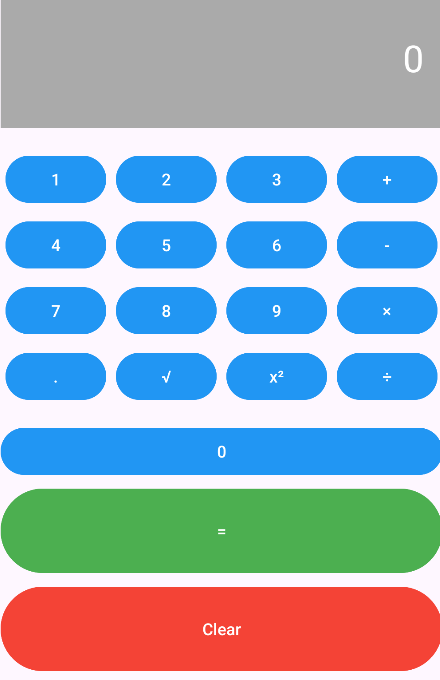

# Android Kotlin Calculator

A working calculator app built in Kotlin using Android Studio.

Features a clean, interactive interface following good Android usability, accessibility, and design principles.

---

## Features

- **Addition**, **Subtraction**, **Multiplication**, **Division**  
- **Square** and **Square Root**  
- **Decimal input support**  
- Interactive interface following standard Android UI practices  
- Simple, clean design with **button grid layout** for easy user interaction

---

## Screenshot

Screenshot of the **easy-to-use, color-coded, grid UI** for the calculator interface:

